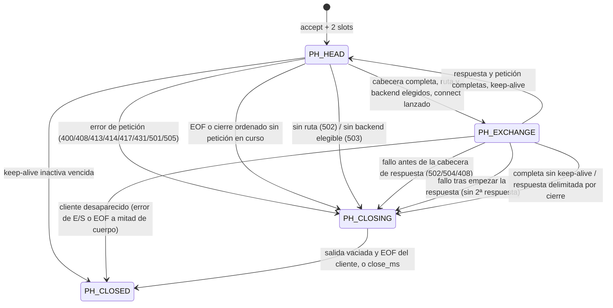

# Arquitectura del proxy inverso

Este documento fija el diseño y registra qué parte existe. Cada sección
indica su estado:

- **Implementado**: existe código y pruebas (ver `docs/verification.md`).
- **Diseño**: decisión tomada, sin código todavía.

Tras la etapa 5 existe `build/src/proxy`: un proxy HTTP/1.x funcional de
extremo a extremo con un **maestro sin hilos que supervisa N workers**
(procesos con `fork`), varios frontends con `SO_REUSEPORT`, configuración
TOML, `round_robin`/`weighted`/`least_conn` (por worker), health checks
activos (TCP/HTTP, en un hilo de cada worker) y pasivos, recarga con `SIGHUP`
coordinada en dos fases con generaciones refcontadas, reenvío con
backpressure, temporizadores, cierre ordenado coordinado, log asíncrono con
ring buffer por worker y estadísticas JSON por socket UNIX. Las cifras que
traía el README original (54.183 req/s, 22 tests, etc.) eran del enunciado,
no mediciones de esta implementación; la medición propia (mediana de
81.974,62 req/s con 6 workers en una sola máquina WSL2 por loopback) y su
alcance están en `docs/benchmark.md`.

---

## 1. Vista general

```
                    ┌────────────── proceso maestro (1 hilo) ──────────────┐
                    │ config (lee/valida) · señales (self-pipe) · socket   │
                    │ UNIX de stats · reaper y reposición · recarga 2 fases │
                    └───────┬──────────────────────┬───────────────────────┘
       socketpair IPC (tramas)│                      │socketpair IPC (tramas)
            ┌───────────────┴──────┐        ┌──────┴───────────────┐
            │ worker 0             │  ...   │ worker N-1           │
            │  hilo event loop     │        │  hilo event loop     │
            │  hilo health         │        │  hilo health         │
            │  hilo log consumidor │        │  hilo log consumidor │
            │  (hilo de recarga)   │        │  (hilo de recarga)   │
            └──────────────────────┘        └──────────────────────┘
   Sin memoria compartida: todo el estado es de cada worker; el maestro
   solo conoce lo que los workers le envían por IPC.
   Cliente ─► listener (SO_REUSEPORT, uno por worker y frontend)
           ─► client_conn ─► http_parser ─► router ─► backend_pool
           ─► upstream_conn ─► backend
```

## 2. Módulos

| Módulo | Responsabilidad | Hilo/proceso | Estado |
|---|---|---|---|
| `io_event` | API común `io_loop_*`; backends epoll y kqueue | event loop | **Implementado** (epoll: Linux, local y CI; kqueue: macOS 15 en CI, ejecución 36279111225) |
| `timer` | Min-heap de temporizadores; próximo vencimiento como timeout del bucle | event loop | **Implementado** |
| `buffer_pool` | Arena `mmap` de slots de 16 KB con freelist fuera de banda | event loop | **Implementado** y usado por las conexiones |
| `host` | Forma canónica de nombres de host | sin estado | **Implementado** |
| `http_parser` | Cabecera de petición y de respuesta incremental; framing de cuerpos | event loop | **Implementado** |
| `http_forward` | Cabecera hacia el upstream y cabecera de respuesta hacia el cliente | event loop | **Implementado** |
| `router` | djb2 exactos, wildcard por sufijo más largo, default; refcount | event loop | **Implementado** |
| `config` | TOML (tomlc99) → instantánea inmutable validada | arranque | **Implementado** |
| `backend_pool` | **Generación**: instantánea + estado mutable (activas, salud, cursores); `round_robin`, `weighted`, `least_conn`; health activo y pasivo | event loop | **Implementado** |
| `health` | Sondas TCP/HTTP no bloqueantes con su propio `io_loop` | **hilo de health** | **Implementado** |
| `listener` | Sockets de escucha no bloqueantes con `SO_REUSEPORT` | event loop | **Implementado** |
| `conn` | `client_conn` y `upstream_conn` (§5) | event loop | **Implementado** |
| `worker` | Bucle, accept (con descarte ante EMFILE), señales (self-pipe), canal IPC con el maestro, preparación/activación de generaciones, integración de health, instantáneas de estadísticas, cierre ordenado, contabilidad | event loop (+ hilo de recarga efímero) | **Implementado** |
| `master` | `fork` y supervisión de N workers, recarga en dos fases, cierre coordinado, servidor del socket de estadísticas | maestro (sin hilos) | **Implementado** (§14) |
| `ipc` | Tramas de 32 B de cabecera + carga sobre socketpair no bloqueante | maestro y event loop del worker | **Implementado** |
| `log` | Ring buffer 4096 × 512 B e hilo consumidor por worker; modo síncrono en el maestro | varios productores | **Implementado** (§14.5) |
| `stats` | Tipos de contador y composición del JSON agregado | maestro | **Implementado** (§14.6) |
| `diag` | Mensajes de diagnóstico; redirige a `log` | cualquiera | **Implementado** |
| `main` | Argumentos (`-c`, `-t`), lectura única del fichero, arranque del maestro | — | **Implementado** |

Dependencias (sin ciclos): `main → config, master`; `master → worker
(solo en el hijo), ipc, stats, log, config, timer, io_event`; `worker → conn,
listener, backend_pool, health, buffer_pool, timer, io_event, ipc, log, diag`;
`health → config (solo para construir el plan), io_event, timer, listener`; `conn →
http_parser, http_forward, router, backend_pool, buffer_pool, timer,
io_event, listener`; `config → router, host, tomlc99`; `http_parser → host`;
`router → host`.

## 3. `io_event` (implementado)

Ficheros: `src/io_event.h` (API pública), `src/io_event.c` (lógica común),
`src/io_event_backend.h` (contrato interno), `src/io_event_epoll.c`,
`src/io_event_kqueue.c`. Meson compila `io_event.c` más **un** backend
(`-Dio_backend=auto|epoll|kqueue`; `auto` elige epoll en Linux y kqueue en
macOS/BSD).

### 3.1 Semántica

- Siempre edge-triggered: `EPOLLET` (+`EPOLLRDHUP`) y `EV_CLEAR`.
- Intereses: `IO_READ`, `IO_WRITE` (no vacío). Eventos entregados: además
  `IO_HUP` (cierre del par, total o de escritura) e `IO_ERROR`. Un
  `IO_READ/IO_WRITE` fuera del interés actual nunca se entrega.
- `io_loop_mod` con el mismo interés **rearma**: si el fd sigue listo llega un
  aviso nuevo. Es el mecanismo para reanudar trabajo pendiente tras
  backpressure sin esperar datos nuevos.
- kqueue entrega lectura y escritura del mismo fd como entradas separadas; el
  callback puede ser invocado dos veces en el mismo lote (una por filtro).

### 3.2 Tabla de registros y eventos obsoletos

La lógica común mantiene un array indexado por fd con `{cb, userdata,
interest, gen, active}`. Cada `io_loop_add` incrementa `gen` y el kernel
recibe el token `gen << 32 | fd` (`epoll_data.u64` / `kevent.udata`). Al
despachar se descarta cualquier evento cuyo token no coincida con la entrada
actual. Esto cubre el caso de un callback que hace `del + close` de otro fd
y el `accept`/`dup` siguiente reutiliza el número en el mismo lote.

La tabla puede crecer con `realloc` durante un callback, por eso el despacho
no guarda punteros a entradas entre callbacks.

### 3.3 Parada y contextos seguros

| Función | Hilo del bucle | Callback | Otro hilo | Manejador de señal |
|---|---|---|---|---|
| `io_loop_stop` | sí | sí | sí | sí (async-signal-safe) |
| `io_loop_add/mod/del` | sí | sí | no | no |
| `io_loop_run/run_once` | sí | no (`EBUSY`) | no | no |
| `io_loop_destroy` | sí, fuera de `run` | no | no | no |

`io_loop_stop` hace `atomic_store` sobre un `atomic_int` (se exige
`ATOMIC_INT_LOCK_FREE == 2` con `_Static_assert`) y `write()` de un byte en un
pipe interno no bloqueante; preserva `errno`. `io_loop_run` comprueba la
petición antes de cada espera y tras despachar el lote completo: no se
pierden avisos edge-triggered, la petición es persistente (un `stop` antes
de `run` lo hace retornar sin esperar), `run` la consume al retornar y
`EINTR` no es error. `io_loop_run_once` ni la consulta ni la consume. No se
debe llamar a `io_loop_stop` concurrentemente con `io_loop_destroy`.

### 3.4 Propiedad

`io_loop_create` posee el fd epoll/kqueue, el pipe de despertar y la memoria;
`io_loop_destroy` libera todo. Los fds registrados y `userdata` son del
llamador: hay que llamar a `io_loop_del` **antes** de `close(fd)`.

## 4. Módulos de la etapa 2 (implementados)

### 4.1 `timer`

- Tiempo en ms de `CLOCK_MONOTONIC` (`timer_now_ms`). Todas las funciones
  reciben `now_ms` explícito, por lo que la lógica se prueba con tiempo
  simulado.
- Nodos intrusivos (`struct timer` embebido en su propietario); el heap
  guarda punteros. Programar no reserva memoria salvo al crecer el array.
  El propietario debe cancelar el timer antes de liberar su memoria.
- Orden por (plazo, secuencia de programación): mismo plazo → FIFO.
- `timer_heap_run_expired` mueve primero todos los vencidos a una lista y
  después los dispara. Un callback puede cancelar otro vencido (no dispara)
  o reprogramarse, incluso en el pasado: vuelve al heap y no dispara otra vez
  en esa llamada (no hay bucles infinitos).
- Integración: `timer_loop_run_once(loop, heap)` espera en
  `io_loop_run_once` como máximo hasta el próximo plazo (`-1` sin timers,
  saturado a `INT_MAX`), despacha la E/S y dispara los vencidos. El bucle del
  worker (etapa 3) será un `while` sobre esta función con comprobación de
  parada.
- Ámbito: un heap por event loop, solo desde su hilo.

### 4.2 `buffer_pool`

- Arena `mmap(MAP_PRIVATE | MAP_ANONYMOUS)` de `nslots × 16 KB`; páginas
  bajo demanda. Capacidad `1..131072` slots (2 GiB); fuera de rango →
  `EINVAL`.
- Freelist **fuera de banda**: pila de índices más un byte de estado por
  slot. Escribir en un slot ya devuelto no puede corromper la freelist.
- `acquire` O(1), LIFO (reutiliza el slot más reciente, caliente en
  caché); agotado → `NULL` con `ENOBUFS`.
- `release` valida antes de modificar nada: puntero nulo, fuera de la
  arena, no alineado al inicio de un slot o de otro pool → `EINVAL`; slot ya
  libre → `EALREADY`. En ambos casos la freelist queda intacta.
- Contenido no definido al reservar (no se limpia).
- Ámbito: un pool por worker, solo desde el hilo del event loop; no es
  thread-safe. Con `MAP_PRIVATE`, tras `fork` cada proceso tiene su copia:
  el pool se crea **después** del `fork`, en cada worker.
- Límite de memoria del worker: `max_connections × 2` slots (un buffer por
  sentido) más la arena de conexiones; con el pool agotado el socket
  aceptado se cierra y se contabiliza.

### 4.3 `host`

Forma canónica compartida por parser y router: minúsculas, sin punto final,
etiquetas de 1..63 bytes (`[a-z0-9-_]`, sin `-` inicial ni final), total
≤ 253; IPv6 entre corchetes: primero una política propia de caracteres
(solo hexadecimales, `:` y `.` para IPv4 embebida; se rechaza cualquier
identificador de zona `%…`/`%25…` sin depender de `inet_pton`, que en macOS
los acepta), después `inet_pton` y reescritura con `inet_ntop`
(`[0:0::1]` → `[::1]`); puerto opcional 1..65535
separado del nombre. Se rechazan `%`-escapes, userinfo y `*`.

### 4.4 `http_parser`

- **Incremental**: el llamador acumula bytes en un buffer contiguo (un slot)
  y llama al parser tras cada lectura; el parser recuerda hasta dónde exploró
  (coste lineal aunque la cabecera llegue byte a byte). Los resultados son
  desplazamientos en el buffer (válidos si se compacta).
- Detección temprana: LF sin CR, línea de petición > 8 KB (`414`) y
  cabecera > 16 KB (`431`) se rechazan en cuanto se superan, sin esperar al
  final.
- El cuerpo se delimita en streaming con `http_body` (no se almacena) y lo
  que sigue es la siguiente petición (pipelining).
- Decisiones HTTP concretas en §6.

### 4.5 `http_forward`

Separado del parser: lee la petición analizada y escribe una cabecera nueva
en otro buffer. Política en §6. Nunca modifica el buffer original.

### 4.6 `router`

- Exactos en tabla hash djb2 (`h = h * 33 + c`, `h0 = 5381`, 32 bits) con
  encadenamiento; toda coincidencia se confirma comparando longitud y
  bytes, así que las colisiones de hash no producen rutas falsas.
- Wildcards `*.sufijo` en una segunda tabla djb2 indexada por el sufijo. La
  búsqueda recorre los `.` del host de izquierda a derecha: el primer sufijo
  encontrado es el **más largo** (el más específico). Así se resuelven los
  wildcards solapados.
- Un wildcard exige al menos una etiqueta completa delante: `*.example.com`
  coincide con `a.example.com` y `a.b.example.com`, pero no con
  `example.com` ni con `badexample.com`.
- Precedencia: exacto → wildcard → default → `ROUTE_NONE` (el proxy
  responderá `502`).
- Patrones normalizados con `host`; se rechazan con diagnóstico (índice y
  motivo) patrones inválidos, puertos, wildcards anidados o sobre IPv6, y
  duplicados tras normalizar.
- **Snapshot inmutable**: tras `router_build` no cambia. Contador de
  referencias atómico (`router_ref`/`router_unref`, liberación con
  `acq_rel`). En la etapa 3 el snapshot de configuración contendrá el
  router y los pools de backends; las conexiones tomarán referencia al
  snapshot, no al router por separado.

## 5. Conexiones: cliente y upstream (implementado, `src/conn.c`)

La conexión del cliente y la del upstream son objetos distintos. El
upstream se cierra tras cada petición, pero su liberación pasa por un único
punto, `upstream_release(c, reusable)`, donde se enganchará un pool de
conexiones persistentes sin rehacer la máquina del cliente.

### 5.1 Modelo de ejecución

Todo evento (E/S del cliente, E/S del upstream, temporizador) termina en
`client_run(c)`, que repite un `step` mientras haya progreso. Cada paso:
leer del cliente → procesar según la fase → E/S con el upstream → procesar
la respuesta → comprobar el final → escribir al cliente.

- **Edge-triggered sin perder progreso**: cada socket tiene marcas
  `readable`/`writable` que se activan con el evento y solo se desactivan al
  obtener `EAGAIN`. Si una lectura se detuvo por buffer lleno
  (backpressure), la marca sigue activa y se reanuda en cuanto hay hueco, sin
  esperar un evento que no llegaría. Una mutación que borra la marca al
  llenarse el buffer bloquea la transferencia y la detectan las pruebas
  (`docs/verification.md`).
- **Equidad**: cada `client_run` tiene un presupuesto de 64 pasos; si se
  agota, un temporizador de 0 ms reanuda la conexión en la siguiente vuelta
  del bucle.
- **Memoria acotada**: 2 slots de 16 KB por cliente (entrada y salida) y 2
  por upstream. Con un buffer lleno se deja de leer del origen.

### 5.2 `client_conn`

Fases: `PH_HEAD` (esperando/analizando la cabecera), `PH_EXCHANGE` (petición
en curso), `PH_CLOSING` (vaciado de la salida, `shutdown(SHUT_WR)` y descarte
de lo que llegue hasta el EOF del cliente o `close_ms`) y `PH_CLOSED`
(se libera al final de `client_run`).



### 5.3 `upstream_conn`

Posee su socket y dos slots: `out` (cabecera reescrita por `http_forward` y
el cuerpo copiado desde la entrada del cliente según el framer) e `in`
(respuesta sin procesar). Se crea en `start_exchange` y se libera en
`upstream_release`: `io_loop_del`, `close`, devolución de slots y
`backend_pool_release`. `connect` no bloqueante; al primer evento se
comprueba `SO_ERROR`.

### 5.4 Respuestas

- La cabecera de respuesta se analiza de forma incremental
  (`http_parse_response`) y se **reconstruye** para el cliente con
  `http_forward_response`: línea `HTTP/1.1 <código> <motivo>`, sin
  hop-by-hop ni cabeceras nombradas en `Connection`, con la decisión propia
  del proxy (`Connection: close`, o `Connection: keep-alive` para clientes
  HTTP/1.0 que la mantienen).
- Framing: `Content-Length`, `chunked` (se reenvía tal cual, con trailers) o
  delimitado por cierre. Sin cuerpo: 1xx, 204, 304 y respuestas a `HEAD`.
- **Delimitada por cierre**: se reenvía y se cierra también la conexión del
  cliente (se anuncia `Connection: close`); nunca se anuncia keep-alive sin
  poder delimitar la respuesta.
- `chunked` hacia un cliente HTTP/1.0 → 502 (no se puede entregar).
- 1xx distintas de 101 (100, 103) se descartan; el `100 Continue` que
  recibe el cliente lo genera el proxy (§6.2).
- **101**: el proxy nunca reenvía `Upgrade`, así que un 101 es una respuesta
  inválida → 502.
- **Truncada** (EOF antes de completar `Content-Length` o chunked) o
  inválida a mitad: se entrega lo recibido y se cierra la conexión del
  cliente. **Nunca** se escribe una segunda respuesta de error en un flujo
  ya empezado (`response_started`).
- Cabecera inválida, EOF sin respuesta o cabecera mayor que un slot → 502 si
  aún no se ha enviado nada.

### 5.5 Keep-alive del cliente frente a reutilización del upstream

| | Cliente ↔ proxy | Proxy ↔ upstream |
|---|---|---|
| Esta versión | keep-alive según HTTP/1.x, `Connection`, `max_requests_per_connection`, cierre ordenado y framing de la respuesta | una conexión por petición con `Connection: close` |
| Quién decide | `start_exchange` + `response_head` | `upstream_release(…, reusable)` (hoy siempre cierra) |
| Contabilidad | — | `upstream_reusable` cuenta las que habrían sido reutilizables |

Pipelining secuencial: los bytes que siguen al cuerpo de una petición se
quedan en el buffer de entrada (como máximo un slot; con él lleno se deja de
leer) y se analizan cuando la respuesta anterior está completa. Las
respuestas salen en orden.

Si el upstream responde antes de recibir todo el cuerpo (p. ej. 413), se
reenvía la respuesta y se cierra la conexión del cliente: no se puede saber
dónde empezaría la siguiente petición.

### 5.6 Plazos

Un temporizador por conexión (`deadline`), reprogramado cuando hay progreso;
tabla completa en `docs/configuration.md`:

| Situación | Plazo | Al vencer |
|---|---|---|
| Cabecera de petición en curso | `client_header_ms` absoluto desde el primer byte (sin "slowloris") | 408 |
| Primera petición sin bytes | `client_header_ms` desde el accept | cierre silencioso |
| Keep-alive sin bytes | `client_idle_ms` | cierre silencioso |
| `connect` al upstream | `upstream_connect_ms` | **504** y fallo contabilizado |
| Petición enviada, sin cabecera de respuesta | `upstream_response_ms` | **504** |
| Cuerpos sin progreso | `io_idle_ms` | 504 (upstream lento) / 408 (cliente lento) si no hay respuesta; si la hay, cierre |
| Cierre | `close_ms` absoluto | cierre forzado |

### 5.7 Propiedad y liberación seguras

- Solo `client_run` libera un `client_conn`, al final de su ejecución, si la
  fase es `PH_CLOSED`. Ningún paso libera la conexión a mitad.
- `client_free`: cancela los dos temporizadores, libera el upstream,
  `io_loop_del` + `close` del socket, devuelve los slots, se desenlaza de la
  lista, suelta su referencia a la generación y libera la memoria.
- Los eventos ya recogidos del kernel para un fd retirado se descartan por
  la generación del registro (`io_event` §3.2): un callback nunca recibe una
  conexión liberada, aunque el número de fd se reutilice en el mismo lote.
- Los callbacks del upstream reciben el `client_conn` propietario y
  comprueban que el fd sigue siendo el del upstream actual.

## 6. Decisiones HTTP

Todo lo de esta sección está **implementado y probado** (unitarias e
integración) salvo lo marcado como fuera de alcance.

### 6.1 Fuera de alcance (explícito)

- **TLS**: no hay HTTPS; un frontend en el 443 sirve HTTP en claro. En
  absolute-form, `https://` → 400.
- **HTTP/2**: `HTTP/2.0` en la línea de petición → 505 (incluido el
  prefacio `PRI * HTTP/2.0`).
- **Cambio de protocolo (WebSocket, h2c)**: cualquier petición con cabecera
  `Upgrade` se **rechaza con 501** y `Connection: close`. No se elimina
  `Upgrade` para reenviarla como petición normal. Un 101 del upstream → 502.
- **CONNECT**: 501; no hay túneles.
- **Reutilización de conexiones al upstream**: no (§5.5).

### 6.2 Petición

- Solo CRLF; LF o CR sueltos, `obs-fold`, espacio antes de `:`, nombre
  vacío, controles o NUL → 400.
- Versión `HTTP/1.0` o `HTTP/1.1`; otra `HTTP/d.d` → 505.
- Formas: origin, absolute (`http://`, reenviada como origin) y asterisk solo
  con `OPTIONS`.
- **Host**: obligatorio en HTTP/1.1 y único siempre (400). Normalizado para
  enrutar (minúsculas, puerto aparte, sin punto final); al upstream se envía
  el valor original. HTTP/1.0 sin Host → ruta por defecto.
- **Framing**: `Transfer-Encoding` en 1.0 → 400; `Content-Length` +
  `Transfer-Encoding` → 400; TE distinto de exactamente `chunked` → 501;
  `Content-Length` repetido solo si coincide.
- **Hop-by-hop**: se eliminan `Connection`, `Keep-Alive`,
  `Proxy-Connection`, `TE`, `Upgrade` (que además provoca el 501) y las
  cabeceras nombradas en `Connection`. Si `Connection` nombra
  `Content-Length`, `Transfer-Encoding` o `Host` → **400**: retirarlas
  cambiaría el framing o el destino (se evita la ambigüedad).
- **Expect**:
  - `100-continue` en HTTP/1.1 con cuerpo: el **proxy** responde
    `HTTP/1.1 100 Continue` en cuanto acepta la petición (ruta y backend
    elegidos, connect lanzado), sin esperar al upstream, y **no** reenvía
    `Expect`. El cliente nunca queda esperando un 100 que no llega. Si
    después hay un error, se envía la respuesta final de error (válido tras
    un 100).
  - en HTTP/1.0 se ignora (RFC 9110 §10.1.1) y tampoco se reenvía.
  - cualquier otro valor → 417 inmediato, sin esperar el cuerpo.
- **Límites**: cabecera `max_header_bytes` (431), línea `max_request_line`
  (414), `max_headers` (431), `max_body_bytes` (413).

### 6.3 Cabeceras de reenvío y política de confianza

- Por defecto ningún cliente es de confianza: se eliminan
  `X-Forwarded-For`, `X-Real-IP`, `X-Forwarded-Proto` y `Forwarded`
  recibidas y se generan `X-Forwarded-For: <ip del par>`,
  `X-Real-IP: <ip del par>`, `X-Forwarded-Proto: http`.
- Solo si la IP del par (no una cabecera) está en `trusted_proxies` del
  frontend: se combinan en orden las `X-Forwarded-For` recibidas y se añade
  la IP del par; se conservan la primera `X-Real-IP` y
  `X-Forwarded-Proto` recibidas. `Forwarded` se elimina siempre.
- La IP del par se valida (`[0-9a-fA-F:.]`) antes de escribirla.
- `Host` se envía con el valor original (o la autoridad en absolute-form);
  se añade `Connection: close`.

### 6.4 Errores del proxy

| Situación | Código |
|---|---|
| Petición inválida o ambigua | 400 (y 414/431/413/417 según §6.2) |
| Cabecera no terminada dentro de `client_header_ms` | 408 |
| `Upgrade`, `CONNECT`, TE no soportado | 501 |
| Versión no soportada | 505 |
| Sin ruta (ni exacta, ni wildcard, ni default) | **502** |
| Fallo al conectar, EOF sin respuesta, respuesta inválida, 101, cabecera > 16 KB | **502** |
| Ningún backend elegible (todos caídos o en su `max_conns`), o saturación local (sin slots ni fds para el upstream) | **503** |
| Timeout de connect o de respuesta del upstream antes de enviar nada al cliente | **504** |
| Cualquier fallo con la respuesta ya empezada | cierre, sin segunda respuesta |

Todas las respuestas de error propias llevan `Content-Length`,
`Connection: close` y cuerpo `"<código> <motivo>\n"` (sin cuerpo si la
petición era `HEAD`), y van seguidas de un cierre ordenado.

**No se reintenta** con otro backend: ni tras un fallo de conexión (se
responde 502) ni, sobre todo, después de haber enviado bytes de la petición.
Reintentar un connect fallido sería seguro y queda como mejora.

## 7. Configuración, generaciones y recarga (implementado)

### 7.1 Configuración

Esquema en `docs/configuration.md`. `config_load_*` valida y construye una
**instantánea inmutable** (`struct config`, con el router) con contador de
referencias atómico. `proxy -t -c fichero` valida sin abrir sockets.

### 7.2 Generaciones y registro de backends

Dos niveles (`src/backend_pool.h`):

- **Registro de backends** (`backend_registry`, uno por worker): estado
  **operativo** de cada backend lógico, que sobrevive a las recargas.
  Identidad estable = **(nombre del pool, dirección IP:puerto)**. Guarda
  conexiones activas, salud y sus contadores consecutivos, veces elegido y
  fallos de conexión. Límites y contadores son **por pool/backend**, no por
  dirección global: la misma dirección en dos pools son dos backends
  lógicos, cada uno con su `max_conns` (que se configura por entrada de
  pool). Cada entrada está referenciada por las generaciones que la
  contienen y se libera con la última.
- **Generación** (`backend_pools`): instantánea de configuración (con sus
  `max_conns`, pesos, salud configurada, algoritmo) más el estado de sus
  algoritmos (cursor de round robin y contadores de weighted), que dependen
  de la composición del pool en esa configuración. Id creciente (1 al
  arrancar).

Referencias (no atómicas: solo el hilo del event loop):

| Quién referencia | Qué | Cuándo la suelta |
|---|---|---|
| El worker | la generación vigente | al publicar otra, o al salir |
| Cada `client_conn` | la generación vigente, adoptada antes del primer byte de cada petición | al adoptar otra o al liberarse |
| Cada generación | las entradas del registro de sus backends | al liberarse la generación |
| El hilo de health | **nada**: recibe copias | — |

Una petición termina siempre con la generación con la que empezó (enrutado,
backend y `release`), y la siguiente de una conexión keep-alive ya usa la
nueva. `generations_live` y `backends_live` en la contabilidad lo muestran;
al salir se exige 0 y 0 (`shutdown final …`).

### 7.3 Recarga sin bloquear el event loop

Desde la etapa 5 el `SIGHUP` lo recibe el **maestro**, que coordina la
recarga en dos fases (§14.3). Lo que sigue describe el lado del worker:
el `PREPARE` del maestro sustituye a la señal y la respuesta
(`PREPARED_OK/ERR`) sustituye a la activación inmediata, que espera al
`COMMIT`.

1. Llega `PREPARE` por el canal IPC con los bytes de la configuración.
2. El bucle crea un **hilo de recarga** (señales bloqueadas) que analiza y
   valida ese texto, marca `done` (atómico, *release*) y, como **última acción
   antes de retornar**, escribe un byte en un pipe.
3. El bucle recoge el resultado **solo cuando recibe ese aviso y ve `done`**
   (*acquire*). El `pthread_join` que sigue solo espera a que el hilo retorne
   tras esa última escritura: no hay lectura ni validación pendientes. El
   event loop nunca espera a un hilo que está trabajando.
4. En el event loop: cierre en curso → se descarta; inválida → se rechaza con
   el diagnóstico; `config_reload_compatible` falla → se rechaza con las
   diferencias; si no → nueva generación `id + 1`, pasa a vigente, se suelta
   la anterior y se envía un plan nuevo al hilo de health.
5. `SIGHUP` durante una recarga: `reload_pending` y **una** recarga más al
   terminar. Durante el cierre se ignora.
6. **Cierre con una recarga en curso**: el bucle principal sigue girando
   (`while (!stop || reload != NULL)`) hasta recibir el aviso; mientras
   tanto sigue atendiendo señales y temporizadores. Después descarta el
   resultado. Solo tras un **error fatal del bucle** se hace un join que
   podría esperar trabajo (queda registrado en stderr).

Retardo artificial para pruebas: solo en el ejecutable **`proxy-testhooks`**,
compilado con `-DPROXY_TEST_HOOKS` (`src/meson.build`). El ejecutable
`proxy` no contiene ese código ni el nombre de la variable (una prueba lo
comprueba en el binario y por comportamiento).

### 7.4 Estado entre generaciones

- **Conexiones activas**: son del backend lógico. `least_conn` y
  `max_conns` de una generación nueva cuentan las conexiones de las
  anteriores al mismo pool/backend. Cada conexión decrementa la misma entrada
  que incrementó (con la generación y la selección del `pick`), también con
  error, cancelación o cierre forzado.
- **max_conns reducido** por debajo de las activas: las existentes terminan
  (no se cortan) y no se asignan nuevas hasta que `active < max_conns`.
- **Eliminar y reintroducir** un backend: mientras quede una conexión de una
  generación que lo contiene, su entrada sigue viva; si una recarga lo
  reintroduce en el mismo pool, reutiliza la entrada con sus activas y su
  salud. Si ya no quedaba ninguna, empieza de cero (sano, sin activas).
- **Salud**: es del backend lógico (se conserva entre recargas). En un pool
  sin `[pool.health]` el backend se considera sano y su entrada se reinicia
  a sano al crear la generación.
- **Contadores** (`selected`, `failures`): acumulados por backend lógico.
- **Algoritmos**: cursor de round robin y contadores de weighted son de cada
  generación (empiezan de cero tras una recarga).

### 7.5 Health checks

**Activos** (`src/health.c`), en un hilo dedicado con su propio `io_loop` y
`timer_heap`:

- Un plan por generación: copia autocontenida de cada objetivo (dirección,
  petición HTTP ya construida, plazos, rango de estados) con su id de
  generación. El hilo no accede a `config` ni a las generaciones.
- Una sonda en curso por backend, `connect` no bloqueante, plazo
  `timeout_ms`, buffer de 512 bytes, siguiente inicio a `interval_ms` del
  anterior.
- Al llegar un plan nuevo, las sondas inactivas del anterior se eliminan y
  las que están en curso terminan (acotadas por su timeout) e informan con su
  generación antigua.
- Resultados etiquetados `(generación, pool, backend, ok)`. El event loop
  aplica solo los de la generación vigente; los demás se cuentan
  (`health_stale`) y se descartan: una sonda antigua nunca modifica la
  configuración nueva.
- `fall` fallos seguidos → caído (`down-active`); `rise` éxitos → sano.

**Pasivos** (`src/conn.c`): un fallo de conexión atribuible al backend
(rechazo, timeout de connect, inalcanzable…) cuenta; `passive_fall` seguidos
→ `down-passive`. Un connect correcto reinicia la cuenta. Solo las sondas lo
readmiten, por eso el pasivo solo existe en pools con `[pool.health]`. No
cuentan errores del cliente ni saturación local.

Todos caídos (o todos en `max_conns`) → `503`.

## 8. Sincronización

| Recurso | Escritores | Lectores | Mecanismo |
|---|---|---|---|
| Petición de parada de un `io_loop` | cualquier hilo o señal | hilo del bucle | `atomic_int` lock-free + pipe de despertar |
| Señales del proceso | manejador | event loop | self-pipe; los hilos auxiliares nacen con **todas las señales bloqueadas** |
| Buzón de planes de health | event loop | hilo de health | 1 elemento, `pthread_mutex`; un plan nuevo sustituye al pendiente; aviso por pipe |
| Cola de resultados de health | hilo de health | event loop | circular de 1024, `pthread_mutex`; llena → se descarta y se cuenta (`health_dropped`, atómico); aviso por pipe no bloqueante |
| Contadores `probes_done`, `dropped`, `stopping` del hilo de health | hilo de health / event loop | ambos | `atomic_*` |
| Trabajo de recarga (`reload_job`) | hilo de recarga | event loop | `done` atómico (release/acquire) + aviso por pipe como última acción del hilo; el loop lo lee solo tras ver `done` |
| Registro de backends | event loop | event loop | un solo hilo (refcount no atómico) |
| Instantánea `config` | nadie (inmutable) | event loop, hilo de recarga (la crea) | refcount atómico |
| Generaciones, conexiones, timers, `buffer_pool`, parser | event loop | event loop | sin sincronización: propiedad de un solo hilo |

Verificación: ThreadSanitizer (build aparte con Clang) sobre todas las
pruebas unitarias y de integración, sin informes; y una mutación que quita el
mutex de la cola de resultados es detectada por TSan como carrera. Ver
`docs/verification.md`. Esto no demuestra la ausencia de carreras en caminos
no ejercitados.

## 9. Procesos, workers e hilos

**Implementado.** Un proceso **maestro** de un solo hilo y N procesos
**worker** (§14). Cada worker tiene:

| Hilo | Vida | Posee |
|---|---|---|
| Principal (event loop) | todo el worker | `struct worker`, listeners, conexiones, generaciones, registro, `buffer_pool`, timers, self-pipe, canal IPC, pipes de aviso (lectura) |
| Health | de `worker_start` a `worker_cleanup` (`health_stop` + join) | su `io_loop`, `timer_heap`, sondas y sus sockets, extremo de escritura del pipe de resultados |
| Recarga | una preparación (join al terminar o al salir) | su `reload_job` hasta el join |
| Consumidor de log | de `log_open` a `log_stop` | el fd del log, su lote de registros |

Los hilos se crean **solo después del `fork`**, dentro del worker, y con
todas las señales bloqueadas. El maestro no crea ninguno, así que cada
`fork` (arranque o reposición) se hace desde un proceso de un hilo.

## 10. Propiedad y ciclo de vida de recursos

| Recurso | Propietario | Se libera en |
|---|---|---|
| `io_loop`, `timer_heap`, `buffer_pool` | worker | `worker_cleanup`, después de la contabilidad |
| Generación (`backend_pools`) | refcount: worker (vigente) + conexiones | última referencia (§7.2) |
| Entrada del registro (backend lógico) | refcount: generaciones que la contienen | última generación liberada |
| Registro | worker | `worker_cleanup`, tras comprobar que está vacío |
| Hilo de health y sus sondas | worker / hilo de health | `health_stop` (join) antes de la contabilidad final |
| Plan de health | event loop hasta `health_submit_plan`; después, el hilo | `apply_plan` o sustitución en el buzón |
| Hilo y `reload_job` | worker | tras el join, en `on_reload_done` o `worker_cleanup` |
| fd de reserva (EMFILE) | worker | `worker_cleanup` |
| Listener | worker | inicio del cierre ordenado (`close_listeners`) |
| Self-pipe de señales | worker | `restore_signals` |
| Instantánea de configuración | refcount: `main` y cada generación | última referencia |
| `client_conn`, su socket, 2 slots, 2 timers | lista del worker | `client_free` (solo desde `client_run`) |
| `upstream_conn`, su socket, 2 slots | el `client_conn` durante el intercambio | `upstream_release` |
| Selección de backend (`active`) | el `upstream_conn` | `upstream_release` → `backend_pool_release` |

| Canal IPC (worker) | worker | `worker_cleanup` |
| Canales IPC, `struct slot`, clientes de estadísticas, socket de estadísticas | maestro | fin de `master_run`; en el hijo, `release_in_child` justo tras el `fork` |
| Logger del worker (ring, hilo, fd) | worker | `log_stop` al final de `worker_run` |

Contabilidad: cada worker la expone en su instantánea de estadísticas
(§14.6: conexiones, upstreams, slots prestados, activas por backend,
generaciones y backends vivos). Al salir cada worker escribe las líneas
`shutdown …`; si queda algo prestado sale con código 70 y el maestro
también. Las pruebas de integración exigen reposo total tras cada escenario
usando esta contabilidad (vía el socket de estadísticas), no solo Valgrind.
`SIGUSR1` ya no se usa (se ignora).

## 11. Señales y cierre ordenado (implementado)

- Los manejadores (maestro y workers) solo hacen `write()` del número de
  señal en un pipe no bloqueante (async-signal-safe, preservando `errno`);
  el bucle lo lee.
- **Maestro**: `SIGTERM`/`SIGINT` → cierre coordinado (§14.4); `SIGHUP` →
  recarga (§14.3); `SIGCHLD` → recoger hijos (`waitpid(WNOHANG)` en bucle);
  `SIGUSR1` y `SIGPIPE` ignoradas.
- **Worker** (lo recibe del maestro): **SIGTERM/SIGINT** (primer aviso): se
  cierran los listeners (no se aceptan conexiones nuevas), se cierran las
  conexiones inactivas, se desactiva el keep-alive (las respuestas en curso
  salen con `Connection: close`) y se arma `shutdown_timeout_ms`. El worker
  termina cuando no quedan conexiones, o al vencer el plazo (se cierran las
  restantes). **Segundo aviso**: cierre forzado inmediato. `SIGHUP`,
  `SIGUSR1` y `SIGPIPE` se ignoran en el worker (la recarga llega por IPC).
  Si el canal con el maestro se cierra (el maestro murió), el worker inicia
  el mismo cierre ordenado.
- Cada worker vive en su propio grupo de procesos (`setpgid`): un Ctrl-C en
  la terminal llega solo al maestro, que coordina el cierre.
- Cierre durante una recarga: se descarta (ABORT a los workers).
- **accept con EMFILE/ENFILE**: se cierra el fd de reserva, se acepta la
  conexión pendiente, se cierra de inmediato y se recupera la reserva; se
  repite hasta vaciar la cola. El cliente recibe un cierre al instante en
  vez de quedar colgado, y no hay bucle (sin reserva, reintento con un
  temporizador de 100 ms).
- Cancelación por el cliente: un RST (`ECONNRESET`) aborta el intercambio y
  libera upstream y contador. Un FIN tras enviar la petición completa se
  trata como *half-close*: se espera la respuesta y se entrega.
- Al terminar se liberan sockets, buffers, temporizadores, estado de
  backends, configuración y bucle, en ese orden tras comprobar la
  contabilidad.
- El maestro retira el socket de estadísticas al terminar, solo si sigue
  siendo el que creó (§14.6).

## 12. Calidad y CI

- Formato `.clang-format` (21.1.8), análisis `.clang-tidy` (exclusiones
  razonadas en el fichero; `concurrency-mt-unsafe` vuelve a estar activo al
  existir hilos) y cppcheck, solo sobre `src/` y `tests/`.
- Pruebas: unitarias cmocka (11 suites) e integración en Python (7
  ficheros, `suite: integration`). cmocka se incluye como cabecera de sistema
  (`as_system`), para que sus macros no disparen nuestras advertencias con
  Clang y cmocka 1.1.8.
- `scripts/ci.sh`: build + pruebas; sanitizers; Valgrind (unitarias y proxy
  de integración); **ThreadSanitizer**; lint.
- `proxy-testhooks`: variante de pruebas (ganchos como el retardo de
  recarga); solo la usan las pruebas de integración.
- CI remota: GitHub Actions. La ejecución 36279111225 (commit `bc74bd3`)
  pasó los cuatro jobs (Linux GCC y Clang con ASan/UBSan y Valgrind, TSan
  en Clang, macOS 15 Clang con ASan/UBSan, y lint); la 36250381456 había
  fallado en macOS. GitLab: pipeline #3383 del mismo commit con resultado
  global Passed (por captura; sin detalle por job). Detalle en
  `docs/verification.md`.

## 13. Limitaciones conocidas

- Estado **por worker**, sin memoria compartida: `max_connections`,
  `max_conns`, cursores de balanceo, `least_conn` y salud son de cada worker
  (§14.2). Con N workers un backend puede recibir hasta N × `max_conns`
  conexiones y N veces las sondas.
- El reparto de conexiones entre workers lo decide el núcleo: por hash con
  `SO_REUSEPORT` en Linux; en el modelo compartido (macOS), según quién
  acepta antes (con despertar de todos los workers en cada conexión). En
  ninguno es necesariamente uniforme y una conexión keep-alive se queda en
  su worker.
- En el modelo compartido, un worker en su `max_connections` sigue
  aceptando y cerrando al instante, y compite con los demás por la cola
  común: puede rechazar una conexión que otro worker habría atendido.
- Carrera en un arranque fallido (modelo por worker): si el SIGTERM del
  maestro llega a un worker con la disposición por defecto (antes de
  instalar sus manejadores o después de restaurarlos en su liberación
  final), el worker muere por la señal sin terminar de liberar. Valgrind lo
  muestra como memoria viva, sin errores de acceso (diagnóstico en
  `docs/verification.md`). No afecta al resultado (código 1, sin hijos);
  pendiente.
- Solo son recargables pools, rutas, límites, timeouts, confianza y los
  parámetros de supervisión; workers, max_connections, frontends, `[log]` y
  `[stats]` requieren reiniciar.
- Ventana de transición durante la activación de una recarga (§14.3):
  hasta el plazo de confirmación puede haber workers que acepten
  conexiones nuevas en generaciones distintas; la recuperación completa
  tras un fallo tarda más (§14.3.1). No hay rollback tras la decisión.
- La retirada de un worker que no confirma puede tardar hasta `retire_ms`
  (`max(shutdown_timeout_ms viejo, nuevo) + 5 s`) antes del SIGKILL; con
  plazos de vaciado largos, la reposición se retrasa en consecuencia.
- Si el maestro muere con SIGKILL, los workers se cierran solos (EOF del
  canal), pero el socket de estadísticas queda en disco y el siguiente
  arranque se niega a borrarlo: hay que retirarlo a mano.
- El log del maestro es síncrono en stderr: si stderr se bloquea, el maestro
  espera (no atiende tráfico, pero sí retrasa la supervisión).
- Los contadores acumulados de un worker vuelven a 0 cuando se repone; los
  totales del JSON pueden bajar.
- Health checks por pool: un mismo backend en dos pools se sondea dos veces
  (y además una vez por worker).
- Sin reintento tras un fallo de conexión: la petición que lo descubre recibe
  502.
- Sin pool de conexiones al upstream (un handshake TCP por petición).
- Sin TLS, HTTP/2 ni WebSocket (rechazados explícitamente).
- 1xx informativas del upstream descartadas.
- Direcciones solo como IP literal.
- macOS/kqueue: verificado solo en GitHub Actions (macOS 15, arm64, Apple
  clang 17; ejecución 36279111225), sin Valgrind ni TSan allí y con
  `test_limits` omitida (requiere /proc). Otras versiones o x86_64 no se han
  probado.
- Valgrind y ASan no ven la arena `mmap` de `buffer_pool`; su uso se
  comprueba con la contabilidad propia de slots.
- La prueba de EMFILE se omite bajo Valgrind.
- Rendimiento medido en un solo escenario (una máquina WSL2, loopback,
  respuestas de 16 bytes, 6 workers): mediana de 84.696,99 req/s por el
  proxy frente a 272.084,64 directo (relación 0,311), con una conexión TCP
  al upstream por petición. Ver `docs/benchmark.md`.

## 14. Maestro, workers, IPC, log y estadísticas (implementado, etapa 5)

### 14.1 Arranque y `fork`

1. `main` lee el fichero **una vez** (`config_read_text`, máx. 4 MiB), lo
   analiza y valida. Con `-t` termina ahí.
2. El maestro instala sus señales (self-pipe), elige el **modelo de
   escucha** (abajo) y, en el compartido, abre un socket por frontend; abre
   el socket de estadísticas (§14.6) y, para cada worker, crea un
   `socketpair` y hace
   `fork` **con todas las señales bloqueadas** (un manejador del maestro no
   puede ejecutarse en el hijo antes de restaurar los suyos).
3. En el hijo: señales por defecto, `release_in_child` cierra y libera todo
   lo del maestro (canales de los otros workers, socket y clientes de
   estadísticas, self-pipe, descriptor de epoll/kqueue, sin tocar sus
   registros), `setpgid(0,0)`, y `worker_run`, que abre **sus** listeners con
   `SO_REUSEPORT` (modelo por worker) o adopta las copias heredadas (modelo
   compartido), crea sus hilos (log, health) y envía `READY`. El hijo
   termina con `_exit` (no ejecuta `atexit` ni vacía stdio heredado).
4. El maestro espera `READY` de todos en `ipc_timeout_ms`. Si alguno termina
   o no llega a tiempo (se le manda SIGKILL), es un **arranque fallido**: se
   para al resto y el maestro sale con código 1. Así un puerto ocupado o un
   `[log].dir` inaccesible no dejan procesos huérfanos.

Descriptores: todos los del maestro se abren con `O_CLOEXEC` y el hijo cierra
explícitamente los que heredó y no son suyos (solo conserva su extremo del
socketpair, stdio y, en el modelo compartido, los listeners).

**Modelo de escucha** (`listener_model` en el JSON y en el log del
maestro):

| Modelo | Plataforma | Cómo | Reparto |
|---|---|---|---|
| `per_worker_reuseport` | Linux | cada worker abre su socket con `SO_REUSEPORT` | el núcleo reparte las conexiones nuevas por hash de la conexión |
| `shared_inherited` | resto (macOS) | el maestro abre un socket por frontend **antes** del `fork` (sin `SO_REUSEPORT`); cada worker hereda una copia y todos aceptan de la misma cola | acepta el worker que despierta y llama antes a `accept`; los demás reciben `EAGAIN` |

En macOS `SO_REUSEPORT` permite compartir el puerto pero **no reparte**:
todas las conexiones van a un solo socket, así que con sockets por worker
solo un worker atendía tráfico (observado en GitHub Actions, ejecución
36250381456). En el modelo compartido: un puerto ocupado hace fallar el
arranque en el maestro, antes de crear workers; el maestro conserva sus
copias para las reposiciones y las cierra al empezar el cierre, de modo que
el puerto deja de aceptar cuando los workers cierran las suyas. En
`proxy-testhooks`, `PROXY_TEST_SHARED_LISTENERS` fuerza el modelo compartido
para probarlo también en Linux.

### 14.2 Alcance del estado: por worker

No hay memoria compartida. Cada worker tiene su bucle, su registro de
backends, sus generaciones, su hilo de health y su logger. Consecuencias
(documentadas y probadas en `test_multiprocess.py`):

- `max_connections` es por worker.
- `max_conns` de un backend es **por worker, no global**: con 2 workers y
  `max_conns = 1` el backend llega a 2 conexiones simultáneas (probado), y
  cada worker respeta la suya.
- `round_robin`/`weighted`: cursor por worker; cada worker cumple las
  proporciones sobre lo que él atiende (probado por worker con 3:1).
- `least_conn`: decide con las activas **de ese worker** (probado: en cada
  worker la diferencia entre backends es ≤ 1; el global puede ser mayor).
- Health activo: cada worker sondea por su cuenta, así que **las sondas se
  multiplican por el número de workers** y el estado puede diferir entre
  workers durante un intervalo (el JSON muestra el estado de cada worker y un
  resumen `up`/`down`/`mixed`). El pasivo también es por worker.

Compartir estado exigiría memoria compartida con atómicos o un árbitro en el
maestro (más latencia por petición); se descartó para esta etapa.

### 14.3 Recarga coordinada en dos fases

```
SIGHUP → maestro: lee el fichero 1 vez, valida, compatibilidad
  ├─ inválida/no recargable → "recarga rechazada" (nadie cambia)
  └─ PREPARE(gen=G+1, bytes) a cada worker READY          ─┐ plazo de preparación:
        worker: hilo analiza los MISMOS bytes → compat →   │ ipc_timeout_ms de la
        crea la generación candidata → PREPARED_OK/ERR     ─┘ configuración G
  ├─ algún ERR, plazo vencido o un worker muere
  │     → ABORT a todos (liberan la candidata) → "recarga rechazada"
  └─ todos OK → PUNTO DE DECISIÓN: el maestro adopta G+1 (sin vuelta atrás)
        COMMIT a los participantes → activan → COMMITTED   ─┐ plazo de confirmación:
        │                                                   │ ipc_timeout_ms de la
        │                                                  ─┘ configuración G+1
        │  "activación iniciada: generación G+1 (N workers, plazo …)"
        ├─ todos los participantes vivos confirman
        │     → "recarga aplicada: generación G+1 (N workers)"
        └─ alguno no confirma: muere, envía COMMIT_FAILED o vence el plazo
              → deja de ser participante; si sigue vivo pasa a RETIRING
                (SIGTERM + plazo de retirada → SIGKILL);
                al confirmar los demás (o al vencer el plazo):
                "recarga aplicada: generación G+1 con capacidad reducida
                 (K de N workers confirmados; M por reponer con la generación G+1)"
                → al recoger cada uno: reposición con backoff, arranca con G+1
                → "recuperación completa" o "recuperación agotada" (§14.3.1)
```

- **Mismos bytes**: el maestro lee el fichero una sola vez y lo reenvía; no
  hay carrera si el fichero cambia a mitad de recarga.
- **Identificador de generación**: cada trama lleva `gen`; los workers
  ignoran COMMIT/ABORT que no coinciden con su candidata, y el maestro
  ignora respuestas de otra generación.
- **Abortar libera la candidata**: el worker suelta la generación candidata
  (y las entradas nuevas del registro). Si la preparación aún está en su
  hilo, se marca abortada y se descarta al terminar; un PREPARE posterior
  espera sin bloquear a que acabe (probado: tras matar un worker durante una
  preparación lenta, la siguiente recarga se aplica en todos). Una candidata
  sin COMMIT se descarta sola tras `2 × ipc_timeout_ms`.
- **Ventana de transición**: entre el primer y el último COMMITTED algunos
  workers ya usan G+1 y otros G; un worker que aún no ha activado sigue
  aceptando conexiones nuevas con G. Para las conexiones nuevas, la ventana
  dura como mucho el plazo de confirmación: al vencer, el que no confirmó
  se retira (SIGTERM) y cierra sus listeners en cuanto su bucle procesa la
  señal; si no puede, recibe SIGKILL al vencer el plazo de retirada. Sus
  peticiones en curso terminan con G durante su propio
  `shutdown_timeout_ms` (vaciado, §11). **No hay desfase de versiones
  duradero**: todo worker nuevo arranca con la generación del maestro.
- **Un worker muere durante la preparación**: la recarga se rechaza (ABORT
  al resto); su sustituto arranca con G.
- **Un worker muere durante la activación** (tras la decisión, antes de
  confirmar): **no hay rollback**. El maestro ya adoptó G+1; la recarga se
  completa con los demás, el anuncio indica cuántos quedaron sin confirmar,
  y el sustituto arranca con G+1 después del anuncio. Probado de forma
  determinista (`test_worker_killed_during_commit_is_replaced_with_new_generation`).
- Mientras hay una recarga en curso no se arranca ningún sustituto (la
  reposición se reintenta cada 100 ms hasta que termine) y los `SIGHUP` se
  agrupan en una recarga posterior. `SIGTERM` durante la recarga la
  descarta.
- Dentro de cada worker siguen valiendo las generaciones refcontadas de
  §7.2: las peticiones en curso terminan con su generación.

### 14.3.1 Plazos de la activación, retirada y reposición (según el código)

Son plazos **distintos**; `ipc_timeout_ms` solo cubre la confirmación, no
toda la recuperación.

| Paso | Plazo o espera | Qué ocurre |
|---|---|---|
| Confirmación de la activación | `ipc_timeout_ms` de la **configuración nueva** (el maestro la adopta en el punto de decisión), desde el envío de los COMMIT | Cada participante vivo debe responder COMMITTED. Uno que muere o responde COMMIT_FAILED deja de contar al instante, sin esperar al plazo. |
| Anuncio de la recarga | cuando confirman todos los participantes vivos, o al vencer el plazo de confirmación | `recarga aplicada: generación G+1 (N workers)` solo si confirmaron todos; si no, `… con capacidad reducida (K de N workers confirmados; M por reponer con la generación G+1)`. `reloads_ok` + 1 y la recarga termina (`reload_state = idle`). **Se anuncia antes de que existan los sustitutos.** Mientras falte la confirmación de un participante vivo dentro del plazo, no se anuncia (probado). |
| Retirada (plazo vencido o COMMIT_FAILED) | inmediata: un **SIGTERM** y estado `retiring` | El worker cierra sus listeners y vacía sus conexiones con la generación que tiene (G) y **su** `shutdown_timeout_ms`. Un worker ya en retirada no recibe otro SIGTERM. |
| Plazo de retirada | `retire_ms = max(shutdown_timeout_ms de G, de G+1) + 5000 ms`, fijado en el punto de decisión y contado desde el SIGTERM | Si sigue vivo al vencer: un **SIGKILL** (`sigue vivo tras … ms de retirada: SIGKILL`). El maestro no bloquea: es un temporizador del bucle. El pid no puede estar reutilizado: solo el maestro hace `waitpid` y cancela el plazo antes de soltar el pid. |
| Recogida | `SIGCHLD` → `waitpid` | `worker N (pid P) retirado (código X / señal 9)`. Solo entonces se programa la reposición. Cuenta como caída para `max_restarts` / `restart_window_ms` aunque salga con código 0. |
| Espera antes de reponer | `restart_backoff_ms` (se duplica en caídas seguidas, máx. 30 s; vuelve al inicial cuando el worker queda listo) | Si hay una recarga en curso al vencer, se reintenta cada 100 ms hasta que termine. |
| Arranque del sustituto | `fork` inmediato; `READY` en `ipc_timeout_ms` | Nace con la generación del maestro (la comprometida). Si no está listo a tiempo recibe SIGKILL, y esa salida cuenta como otra caída. `worker N repuesto (pid, generación G+1)`. |
| Recuperación completa | cuando el último sustituto pendiente queda listo con la generación comprometida | `recuperación completa: generación G+1 (N de N workers listos)`; `recovery.state = complete`. |
| Recuperación agotada | más de `max_restarts` caídas en `restart_window_ms` de un puesto pendiente | Ese puesto queda `failed` y no se repone. `recuperación agotada: el worker i no se repone (max_restarts); la generación G+1 sigue activa con K de N workers`; `recovery.state = exhausted`, `degraded = true`. **No hay rollback.** Si todos los puestos quedan `failed`, el maestro termina con código 1 (probado). |

Estados observables (log del maestro y objeto `master` del JSON):

| Situación | Log | JSON |
|---|---|---|
| Activación en curso | `activación iniciada: generación G+1 (N workers, plazo …)` | `reload_state = "committing"`, `reload_in_progress = true` |
| Comprometida con puestos por reponer | `recarga aplicada: … con capacidad reducida (…)` | `reload_state = "idle"`, `recovery = {"state": "pending", "generation": G+1}`, `degraded = true` mientras falten |
| Recuperación completa | `recuperación completa: …` | `recovery.state = "complete"`, `degraded = false` |
| Recuperación agotada | `recuperación agotada: …` (y `recuperación terminada con capacidad reducida` cuando ya no queda ningún puesto pendiente) | `recovery.state = "exhausted"`, `degraded = true`, el puesto `failed` en `workers[]` y en `missing_workers` |

`recovery` describe la última recarga aplicada: la siguiente recarga que
confirman todos lo vuelve a `none` (la capacidad reducida por un puesto
`failed` sigue visible en `workers_ready`, `degraded` y el estado del
puesto).

**Coordinación con el cierre del maestro.** Al empezar el cierre se
cancelan las reposiciones programadas y no se arranca ningún worker. Un
worker en retirada **no** recibe otro SIGTERM y conserva su plazo de
retirada; además le alcanza el plazo global de cierre
(`shutdown_timeout_ms + 5000` ms desde el SIGTERM al maestro): recibe **un
único** SIGKILL, del primero que venza (normalmente el de retirada, que
empezó antes). Un segundo SIGTERM/SIGINT al maestro sí se reenvía a todos,
incluido el que está en retirada (el operador fuerza el cierre). Si hubo que
matar a algún worker, el maestro termina con 70 (probado: cierre durante una
retirada de un worker detenido con SIGSTOP → un SIGKILL, ninguna reposición,
ningún hijo, código 70).

Cota del tiempo hasta tener otra vez N workers listos con G+1, sin más
caídas: fin de la recarga (≤ plazo de confirmación) + salida del retirado
(≤ `retire_ms`; inmediata si murió solo) + `restart_backoff_ms` vigente +
arranque (≤ `ipc_timeout_ms`).

### 14.4 Supervisión y cierre

- `SIGCHLD` → `waitpid(-1, WNOHANG)` hasta vaciar. Un worker que termina
  fuera del cierre del maestro (incluido uno retirado por no confirmar una
  activación) se **repone** tras `restart_backoff_ms` (duplicándose hasta
  30 s en caídas seguidas y volviendo al inicial cuando queda listo); ver
  §14.3.1.
- Límite: más de `max_restarts` en `restart_window_ms` → ese worker queda
  `failed`. Si todos quedan `failed`, el maestro termina con código 1 sin
  dejar hijos (probado con `max_restarts = 0`).
- **Cierre coordinado** (`SIGTERM`/`SIGINT` al maestro): descarta la recarga
  en curso (el socket de estadísticas sigue respondiendo durante el
  vaciado), cancela las reposiciones pendientes, envía `SIGTERM` a cada
  worker (salvo a los que ya están en retirada, §14.3.1) y arma un
  plazo de `shutdown_timeout_ms + 5000` ms; los que sigan vivos reciben
  `SIGKILL` (uno por pid: no se repite si la retirada ya lo envió). Un
  segundo aviso se reenvía a todos (cierre forzado de los workers). El
  maestro sale con 0 si todos salieron con 0; con 70 si alguno salió mal o
  hubo que matarlo; retira su socket y no deja hijos.

### 14.5 Log asíncrono

- Cada worker: ring de **4096 registros × 512 B** protegido por un mutex y
  una variable de condición; los productores (event loop, hilo de health,
  hilo de recarga) formatean fuera del mutex y copian el registro; nunca
  esperan a la E/S.
- **Política ante saturación**: ring lleno → el registro se descarta y se
  cuenta (`log_dropped`). El consumidor escribe periódicamente
  `log: N mensajes descartados (ring lleno)`. Es acotada: memoria fija y sin
  bloqueo del tráfico (probado con un FIFO que nunca se lee y log de acceso
  activo: miles de peticiones servidas, `log_dropped > 0`).
- El consumidor escribe por lotes de 64 con el fd no bloqueante y `poll` en
  pasos de 100 ms (así puede atender la parada). Contadores: `log_written`,
  `log_dropped`, `log_write_errors`, `log_truncated`.
- Registro: `ISO-8601 pid worker level gen mensaje`, máx. 512 B (truncado con
  marca), sin caracteres de control. El log de acceso nunca incluye ruta,
  query, cuerpos ni cabeceras (probado: ni `Authorization`, ni `Cookie`, ni
  un token en la query aparecen).
- **Cierre con plazo**: `log_stop(2000 ms)` vacía lo pendiente; si el destino
  no avanza, lo abandona y el proceso termina igualmente.
- Ficheros por worker (`<dir>/worker-<i>.log`), para no intercalar
  escrituras de procesos distintos; el maestro escribe síncrono en stderr
  (no tiene hilos).

### 14.6 Socket de estadísticas

- **Propiedad**: lo crea el maestro con `umask 0177` y aplica `mode` (0600
  por defecto). Si la ruta existe (fichero, socket ajeno o huérfano) **no la
  borra**: falla el arranque (probado con un fichero y con un socket de otro
  proceso; ambos quedan intactos). Guarda dispositivo e inodo y, al
  terminar, borra la ruta solo si sigue siendo ese socket.
- **Protocolo**: el cliente conecta; no envía nada (lo que envíe se ignora).
  El maestro manda `STATS_REQ` a cada worker listo, espera hasta
  `timeout_ms / 2`, compone el JSON con quienes hayan respondido, lo escribe
  y **cierra**. Un cliente que no lee se expulsa al vencer `timeout_ms`
  (`stats_timeouts`); los que excedan `max_clients` se cierran sin datos
  (`stats_rejected`). El maestro nunca se bloquea: escritura no bloqueante y
  plazo por cliente (probado con clientes que no leen un JSON de 440 KB
  mientras sigue el tráfico).
- **Esquema** (versión 1):
  - `schema`, `complete` (todos los workers respondieron), `missing_workers`,
    `note` (las instantáneas no son simultáneas).
  - `master`: pid, uptime, generación, `workers_configured`,
    `workers_ready` y `degraded` (listos < configurados),
    `reload_in_progress` y `reload_state` (`idle`, `preparing`,
    `committing`), `recovery` (`state`: `none`, `pending`, `complete`,
    `exhausted`, y `generation`; §14.3.1), vaciado, recargas ok/fallidas,
    reposiciones, clientes rechazados/expulsados; y `counter_kinds`
    (`cumulative` o `instant` para cada contador).
  - `workers[]`: índice, pid, estado (`starting`, `ready`, `restarting`,
    `retiring`, `failed`), `restarts`, `responded`, generación, uptime, `counters` y
    `backends[]` (algoritmo, peso, `max_conns`, activas, elegidos, fallos y
    salud **de ese worker**).
  - `totals`: workers que respondieron, generación mínima y máxima,
    `counters` (suma de los que respondieron) y `backends[]` agregados por
    (pool, dirección) con `health_by_worker` y `health_summary`.
- **Tipos de contador**: `cumulative` crece desde el arranque de ese proceso
  worker; `instant` es el valor en su instantánea. Al reponer un worker sus
  acumulados vuelven a 0 (su pid, `uptime_ms` y `restarts` lo delatan). Un
  worker que no responde (caído, reponiéndose o lento) no suma y figura en
  `missing_workers`.
- Cliente: `scripts/proxy-stats.py SOCKET [--json|--raw]`.

### 14.7 IPC

Trama: cabecera de 32 B (`magic "PXY1"`, tipo, longitud, reservado, `gen`
u64, `id` u64) + carga de hasta 8 MiB. Socketpair `SOCK_STREAM` no
bloqueante en los dos extremos, con búferes de entrada y salida; una trama
con magia errónea o longitud excesiva, o el EOF, cierra el canal. Tipos:
`READY`, `PREPARE`, `PREPARED_OK`, `PREPARED_ERR` (motivo),
`COMMIT`, `COMMITTED`, `COMMIT_FAILED`, `ABORT`, `STATS_REQ` (`id` de la
petición) y `STATS` (texto `clave=valor`; el maestro descarta respuestas
duplicadas o tardías por `id`).
